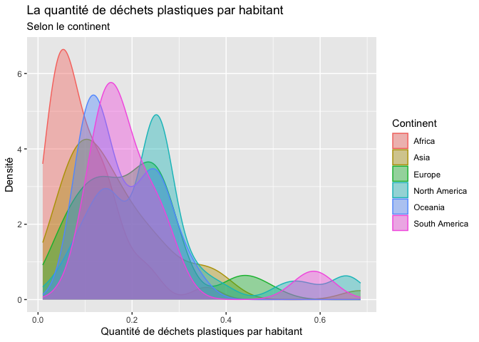

Lab 02 - Plastic waste
================
Alexia De Champlain
17 septembre 2025

## Chargement des packages et des données

``` r
library(tidyverse) 
```

``` r
plastic_waste <- read_csv("data/plastic-waste.csv")
```

Commençons par filtrer les données pour retirer le point représenté par
Trinité et Tobago (TTO) qui est un outlier.

``` r
plastic_waste <- plastic_waste %>%
  filter(plastic_waste_per_cap < 3.5)
```

## Exercices

### Exercise 1

``` r
ggplot(data = plastic_waste, aes(x = plastic_waste_per_cap)) +
  geom_histogram(binwidth = 0.2) +
  facet_wrap( ~ continent)
```

<!-- -->

Certains continents ont des habitants qui produisent plus de déchets que
d’autres. Par exemple, les continents de l’Amérique du Nord, de l’Asie
et de l’Europe sont les plus grands producteurs de déchets. De plus,
l’Océanie et l’Amérique du Sud en produisent moins que les continents.
L’Afrique produit moins de déchets. En effet, pour le premier groupe, la
majorité des habitants produisent de 0,00 à 0,25 kg/jour, alors que la
minorité en produisent plus de 0,25 kg/jour. Pour le groupe de l’Océanie
et de l’Amérique du Sud, la majorité des habitants produisent entre 0,00
et 0,25 kg/jour, alors qu’une petite quantité d’habitants de l’Amérique
du Sud en produisent plus de 0,50 kg/jour, comparé à un maximum de 0,50
kg/jour pour l’Océanie. Finalement, pour l’Afrique, presque tous les
habitants produisent de 0,00 à 0,25 kg/jour.

### Exercise 2

``` r
ggplot(plastic_waste, aes(x = plastic_waste_per_cap)) + 
  geom_density(adjust = 1)
```

<!-- -->

``` r
ggplot(plastic_waste, aes(x = plastic_waste_per_cap, color = continent)) + 
  geom_density(adjust = 1)
```

<!-- -->

``` r
ggplot(plastic_waste, aes(x = plastic_waste_per_cap, color = continent, fill = continent)) + 
  geom_density(adjust = 1)
```

<!-- -->

``` r
ggplot(plastic_waste, aes(x = plastic_waste_per_cap, color = continent, fill = continent)) + 
  geom_density(adjust = 1, alpha = 0.4)
```

<!-- -->

Car aes est dépendant des données, alors que les réglages écrits dans
geom_density() restent constants pour toutes les données.

### Exercise 3

Boxplot:

``` r
# insert code here
```

Violin plot:

``` r
# insert code here
```

Réponse à la question…

### Exercise 4

``` r
# insert code here
```

Réponse à la question…

### Exercise 5

``` r
# insert code here
```

``` r
# insert code here
```

Réponse à la question…

## Conclusion

Recréez la visualisation:

``` r
# insert code here
```
